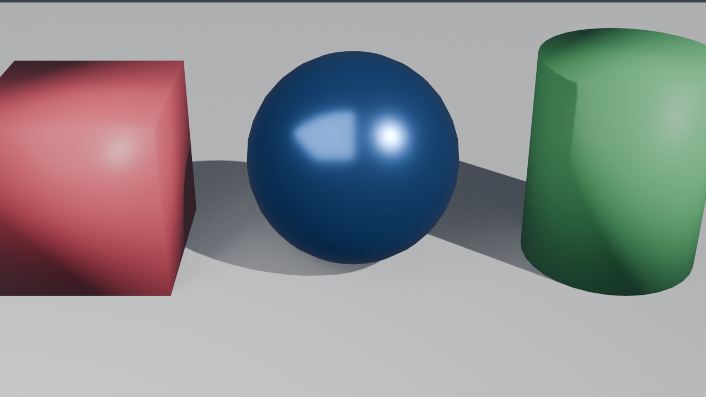

# blender-starter

Generate 3D models with [Blender](https://www.blender.org/) **headlessly** — no GUI clicking. Describe a scene in Python, and Blender builds it, renders a preview, and exports to multiple formats reproducibly.



## What's here

| File | Purpose |
|------|---------|
| `starter_shapes.py` | Builds a scene (cube, sphere, cylinder) with colored materials, soft lighting and a camera; renders a preview and exports the model. |
| `output/` | Generated artifacts (gitignored by default). |

## Requirements

- Blender 5.x (`brew install --cask blender` on macOS)
- No Python deps — uses Blender's bundled `bpy`.

## Usage

```bash
blender --background --python starter_shapes.py
```

On macOS the binary lives inside the app bundle:

```bash
/Applications/Blender.app/Contents/MacOS/Blender --background --python starter_shapes.py
```

## Output

Running the script produces, in `output/`:

- `preview.png` — rendered image (1280×720, EEVEE)
- `starter_shapes.blend` — native Blender file (open & edit in the GUI)
- `starter_shapes.glb` — glTF binary for web / games / AR
- `starter_shapes.obj` + `.mtl` — universal mesh format
- `starter_shapes.stl` — for 3D printing / slicers

## Customizing

Everything is plain `bpy`. Edit `starter_shapes.py` to:

- Change shapes via the `bpy.ops.mesh.primitive_*_add` calls
- Tweak colors/metalness/roughness in `make_material(...)`
- Adjust lighting, camera angle, render resolution, or export formats

The pattern scales to real objects, parametric models, and animations — change the script, re-run, get a fresh model.
